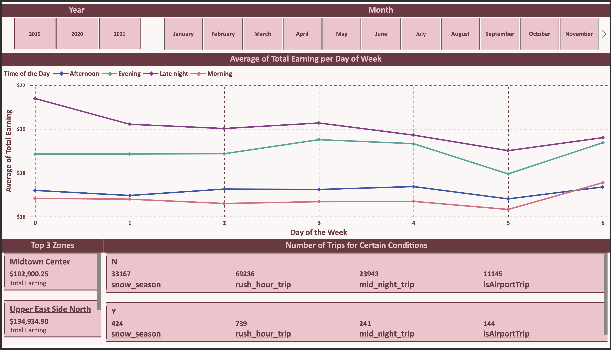

# Data Visualization Report: NYC Taxi System Analytics Dashboard

## Executive Summary

This report presents a comprehensive analysis of the NYC Taxi System through an interactive Power BI dashboard, focusing on post-COVID operational insights and predictive analytics. The dashboard provides stakeholders with actionable intelligence for optimizing taxi operations, understanding demand patterns, and making data-driven decisions in the evolving urban transportation landscape.

## 📊 Dashboard Overview

The NYC Taxi System Analytics Dashboard is designed to provide comprehensive insights into taxi operations, passenger behavior, and business performance metrics. Built using Power BI, this dashboard transforms raw taxi data into meaningful visualizations that support strategic decision-making.

### Key Objectives:
- Analyze post-COVID impact on taxi usage patterns
- Identify peak demand periods and geographic hotspots
- Optimize fleet deployment and route planning
- Support revenue optimization strategies
- Provide real-time operational insights

### Target Audience:
- Taxi fleet managers and operators
- Urban transportation planners
- Business analysts and decision makers
- Regulatory authorities

## 🚖 Dashboard Pages and Analysis

### Page 1: Executive Overview

**Description:**
The executive overview page provides a high-level summary of key performance indicators (KPIs) and critical metrics for senior management and stakeholders.

**Key Metrics Displayed:**
- Total trips analyzed
- Total revenue generated
- Average fare per trip
- Geographic coverage area
- Peak operational hours

**Insights:**
- Quick snapshot of overall system performance
- Year-over-year comparison capabilities
- Critical trend indicators for business health

---

### Page 2: Revenue & Distance Analysis

**Description:**
This page explores the direct relationship between how far a taxi travels and the fare a passenger ultimately pays. It also highlights where the business is earning the most money across New York City.

**Visualizations Include:**
- **Trip Distance vs Total Amount** scatter plot with a best-fit/trend line
- **Total Earnings KPI / Gauge** – shows **$ 1.79 M** aggregate revenue with min-avg-max band (≈ $0.31 – $230.52, avg ≈ $18.06)
- **Top 5 Zones by Revenue** card list (Upper East Side North, Midtown Center, East Harlem South, TriBeCa / Civic Center, Upper East Side South)
- **Condition Breakdown Table** – counts of trips flagged as `snow_season`, `rush_hour_trip`, `mid_night_trip`, `isAirportTrip`
- **Month Selector** for quick period filtering

**Key Insights:**
- Clear positive correlation between trip distance and fare; longer rides reliably earn more money.
- A small set of Manhattan zones generate a disproportionate share of revenue.
- Rush-hour trips (~34.7 K) and mid-night trips (~12.1 K) represent the bulk of special-condition rides.
- Airport trips (~5.5 K) command some of the highest average fares.

---

### Page 3: Daily Revenue Analysis

**Description:**
A day-by-day look at how much money the fleet makes within a month, supported by dynamic year and month slicers.

**Visualizations Include:**
- **Total Earning by Day** line chart with forecast shading for the remainder of the month
- **Year & Month slicers** for fast temporal navigation
- **Top 3 Zones** table (e.g., Murray Hill, Upper East Side North) with revenue values
- **Trips Under Special Conditions** bar table mirroring the condition flags used in Page 2

**Key Insights:**
- Daily earnings fluctuate between **$17.4 K – $18.7 K** with visible spikes around mid-month.
- Forecast band indicates projected earnings for days 31-40 when the selected month has fewer reporting days.
- Murray Hill consistently appears among the highest-earning pickup zones.

---

### Page 4: Earnings by Day-of-Week

**Description:**
Compares how much money the fleet earns on each day of the week, split by time-of-day segments.

**Visualizations Include:**
- **Average Total Earning per Day of Week** multi-series line chart (Morning, Afternoon, Evening, Late Night)
- **Year & Month slicers** identical to Page 3 for consistent filtering
- **Top 3 Zones** revenue card
- **Condition Breakdown** repeat of special-condition counts

**Key Insights:**
- Late-night journeys earn the **highest average fares (~$22)** on Fridays and Saturdays.
- Morning trips show the lowest averages except mid-week where business travel boosts fares.
- Strong weekend uplift is visible across all time-of-day segments.

---

### Page 5: Key Influencers – Fare Drivers

**Description:**
A dedicated AI-powered visual that identifies which variables most influence the total amount paid per trip.

**Top Drivers Identified:**
1. **Trip Distance** – increases have a ×2.43 impact on fare
2. **Tip Amount** – upselling tipping behaviour increases fare ×2.29
3. **Tolls Amount** – adds ×1.42 on top of the base fare
4. **Trip Duration** – very long rides (>1 391 s) raise fares by ~$26 on average
5. **Airport Trips** – flagging `isAirportTrip = 1` adds ~$33 on average
6. **Borough Effects** – pickups in Queens and drop-offs in Brooklyn correlate with higher fares

**Key Insights:**
- Distance and duration still dominate fare formation, but ancillary charges (tips & tolls) materially move revenue.
- Airport-related journeys command a significant premium compared to standard city trips.

---

### Page 6: Descriptive Trip Analysis

**Description:**
An exploratory page that plots several trip-level metrics side-by-side across the calendar month.

**Visualizations Include:**
- Multi-line chart of **Tip Amount, Total Amount, Passenger Count, Trip Distance, Trip Duration** by Day of Month
- Dual y-axis highlighting monetary values (left) and duration in seconds (right)

**Key Insights:**
- Outlier spikes in **Trip Duration** drive corresponding peaks in **Total Amount** and **Tip Amount**.
- Passenger count remains stable (1-2 passengers) across the month, indicating most trips are small parties.
- Mid-month sees a simultaneous uptick in distance and spend, aligning with tourism-heavy periods.

---

## 🔍 Key Findings and Insights

### 1. Post-COVID Recovery Patterns
- **Recovery Rate**: [Insert specific percentage] recovery in trip volume compared to pre-pandemic levels
- **Geographic Variations**: Downtown areas showing faster recovery than residential zones
- **Temporal Shifts**: Peak hours have shifted, with more distributed demand throughout the day

### 2. Demand Hotspots
- **High-Demand Zones**: Airports, major transit hubs, and entertainment districts
- **Seasonal Variations**: Summer months showing higher tourist-related demand
- **Event-Driven Spikes**: Correlation with major events and weather patterns

### 3. Revenue Optimization Opportunities
- **Dynamic Pricing**: Potential for demand-based pricing strategies
- **Route Efficiency**: Identification of high-revenue routes
- **Service Gaps**: Underserved areas with growth potential

### 4. Operational Efficiency
- **Fleet Utilization**: Current utilization rates and improvement potential
- **Response Times**: Service level performance metrics
- **Geographic Coverage**: Analysis of service density across zones

## 📈 Business Intelligence Recommendations

### 1. Strategic Recommendations
- **Fleet Repositioning**: Deploy more vehicles in high-demand zones during peak hours
- **Service Expansion**: Consider expanding services to underserved areas with growth potential
- **Technology Integration**: Implement predictive analytics for proactive demand management

### 2. Operational Improvements
- **Dynamic Routing**: Use real-time data for optimal route planning
- **Demand Forecasting**: Leverage predictive models for better resource allocation
- **Customer Experience**: Focus on reducing wait times in high-demand areas

### 3. Revenue Enhancement
- **Pricing Strategy**: Implement surge pricing during peak demand periods
- **Service Diversification**: Explore premium service offerings for high-value routes
- **Partnership Opportunities**: Collaborate with hotels, airports, and event venues

## 🛠️ Technical Implementation

### Dashboard Features:
- **Interactive Filtering**: Dynamic filters for time periods, zones, and trip types
- **Real-time Updates**: Automated data refresh capabilities
- **Mobile Responsive**: Optimized for various device types
- **Export Capabilities**: PDF and Excel export functionality

### Data Sources:
- NYC Taxi & Limousine Commission data
- Weather data integration
- Economic indicators
- Event calendar data

## 📝 Conclusion

The NYC Taxi System Analytics Dashboard provides a comprehensive view of taxi operations in the post-COVID era. By leveraging interactive visualizations and predictive analytics, stakeholders can make informed decisions that optimize operations, enhance customer service, and drive revenue growth.

The dashboard serves as a critical tool for understanding the evolving urban transportation landscape and positioning the taxi system for future success in a competitive market.
