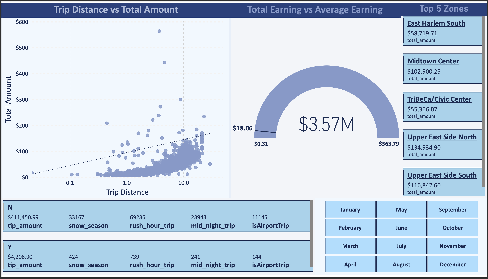
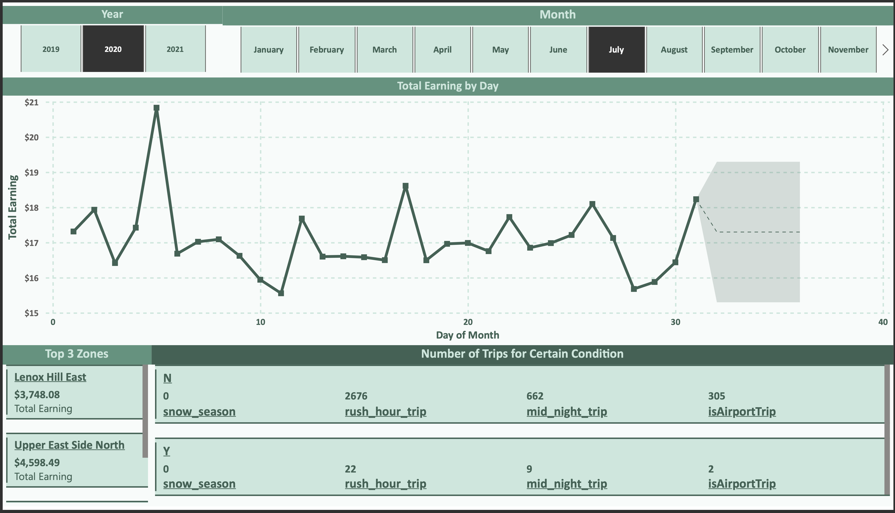

# Data Visualization Report: NYC Taxi System Analytics Dashboard

## Executive Summary

This report presents a comprehensive analysis of the NYC Taxi System through an interactive Power BI dashboard, focusing on post-COVID operational insights and predictive analytics. The dashboard provides stakeholders with actionable intelligence for optimizing taxi operations, understanding demand patterns, and making data-driven decisions in the evolving urban transportation landscape.

## 📊 Dashboard Overview

The NYC Taxi System Analytics Dashboard is designed to provide comprehensive insights into taxi operations, passenger behavior, and business performance metrics. Built using Power BI, this dashboard transforms raw taxi data into meaningful visualizations that support strategic decision-making.

### Key Objectives:
- Analyze post-COVID impact on taxi usage patterns
- Identify peak demand periods and geographic hotspots
- Optimize fleet deployment and route planning
- Support revenue optimization strategies
- Provide real-time operational insights

### Target Audience:
- Taxi fleet managers and operators
- Urban transportation planners
- Business analysts and decision makers
- Regulatory authorities

## 🚖 Dashboard Pages and Analysis

### Page 1: Executive Overview

**Description:**
The Executive Overview page provides a high-level summary of NYC Taxi System performance metrics, highlighting key operational indicators and spatial-temporal patterns for senior management and stakeholders.

**Key Metrics Displayed:**
- **Total Trips**: 99.11 K
- **Total Earnings**: $ 1.79 M
- **Total Distance Travelled**: 233.43 K (miles)
- **Top Pickup Boroughs** (e.g., Manhattan 93.45 %, Queens 5.43 %)
- **Top Drop-off Boroughs** (e.g., Manhattan 90.49 %, Queens 4.28 %)
- **Trip Counts by Month** & **Special Conditions** (`snow_season`, `rush_hour_trip`, `mid_night_trip`, `isAirportTrip`)
- **Geographic Distribution** of pick-up and drop-off locations (interactive maps)

**Interactive Filters Available:**
- Pickup time range slider
- Vendor selector
- Passenger count filter
- Payment mode filter
- Drop-off time-of-day buttons (Afternoon, Evening, Late Night, Morning)

**Insights:**
- Provides an immediate snapshot of overall system scale and revenue generation
- Highlights dominance of Manhattan in both pick-ups and drop-offs
- Reveals seasonal and monthly variations in trip volumes
- Surfaces impact of special trip conditions (rush-hour, airport, etc.) on volumes and revenue
- Shows geographic coverage and density of taxi operations across NYC

---

### Page 2: Revenue & Distance Analysis

**Description:**
This page analyzes how trip distance relates to total fare amount and highlights revenue distribution across top-earning NYC zones. It provides insights into revenue generation patterns, trip conditions, and key performance metrics for strategic planning.

**Visualizations Include:**
- **Trip Distance vs Total Amount** scatter plot with best-fit/trend line to show correlation between distance and fare.
- **Total Earnings KPI / Gauge** displaying overall revenue of **$ 1.79 M**, with min–max–average fare range (**$0.31 – $230.52; average ≈ $18.06**).
- **Top 5 Zones by Revenue** panel listing high-revenue areas:
  1. Upper East Side North
  2. Midtown Center
  3. Upper East Side South
  4. East Harlem South
  5. TriBeCa / Civic Center
- **Condition Breakdown Tables** showing counts of trips flagged for:
  - `snow_season`
  - `rush_hour_trip`
  - `mid_night_trip`
  - `isAirportTrip`
  Split by trips without condition (N) and with condition (Y).
- **Month Selector Grid** highlighting monthly context (January – December).

**Key Insights:**
- Strong positive correlation between trip distance and total fare: longer trips consistently generate more revenue.
- Revenue is heavily concentrated in a few Manhattan zones, indicating high-value catchment areas.
- Special conditions show significant trip volumes:
  - Rush-hour trips (~34.7 K)
  - Midnight trips (~12.1 K)
  - Airport trips (~5.5 K) also command some of the highest average fares.
- Enables understanding of seasonal and temporal demand variations for operational planning.

---

### Page 3: Descriptive Analysis of Trip

**Description:**
This page provides a detailed day-by-day breakdown of key trip metrics within a month, offering a holistic view of operational characteristics and trip patterns.

**Visualizations Include:**
- **Multi-Line Chart** plotting daily values for:
  - `tip_amount`
  - `total_amount`
  - `passenger_count`
  - `trip_distance`
  - `trip_duration` (displayed on a secondary y-axis in seconds)
- **X-axis:** Day of Month (1-31) enabling daily-level analysis of variability.
- **Dual Y-Axis:**
  - Left axis for dollar amounts, passenger count, and distance.
  - Right axis for trip duration in seconds.

**Key Insights:**
- Daily fluctuations in revenue (tip and total amounts), trip distance, and passenger counts are clearly visible.
- `trip_duration` exhibits large variability across days, suggesting traffic or trip-type differences.
- Combined trends help identify operational peaks, consistency, and anomalies throughout the month.
- Useful for monitoring daily patterns and planning for demand management.

---

### Page 4: Earnings by Day-of-Week

**Description:**
This page compares how much the fleet earns on each day of the week, broken down by time-of-day segments. It helps identify temporal earning patterns that can guide scheduling and operational planning.

**Visualizations Include:**
- **Average of Total Earning per Day of Week** multi-line chart segmented by:
  - Morning
  - Afternoon
  - Evening
  - Late Night
- **Year and Month Slicers** (2019 – 2021) for flexible period filtering.
- **Top 3 Zones** revenue cards highlighting high-earning areas (e.g., Murray Hill, Upper East Side North).
- **Condition Breakdown Table** with counts of trips flagged for:
  - `snow_season`
  - `rush_hour_trip`
  - `mid_night_trip`
  - `isAirportTrip`
  Split by trips without condition (N) and with condition (Y).

**Key Insights:**
- **Late Night** trips consistently earn the highest average fares (~ $22), with noticeable increases on weekends (days 5 and 6).
- **Morning** trips show the lowest average earnings across the week.
- **Afternoon** and **Evening** segments maintain moderate earnings with slight day-of-week variation.
- Clear late-week uplift is most pronounced in Late Night fares, supporting demand planning for Friday and Saturday nights.

---

### Page 5: Key Influencers – Fare Drivers

**Description:**
This page uses an AI-powered *Key Influencers* visual to identify and explain which variables most strongly drive the **`total_amount`** paid per trip. It helps uncover actionable factors contributing to fare variation across the NYC taxi system.

**Visualizations Include:**
- **Key Influencers Panel** ranking variables by impact on fare amount:
  - `trip_distance` (impact score **2.43**) – average increase ≈ **+$4.59**
  - `tip_amount` (**2.29**) – **+$2.87**
  - `tolls_amount` (**1.42**) – **+$2.73**
  - `trip_duration` > 1 391 s – **+$26.07**
  - `trip_duration` 1 071 – 1 391 s – **+$7.09**
  - `isAirportTrip = 1` – **+$33.23**
  - `PU_borough = Queens` – **+$28.55**
  - `DO_borough = Brooklyn` – **+$16.31**
- **Scatter Plot** of `trip_distance` vs. *average of* `total_amount` with best-fit trend line illustrating the positive relationship.
- Interactive explanation caption: *“On average when `trip_distance` increases, `total_amount` also increases.”*

**Key Insights:**
- **Distance and duration** are primary drivers of higher fares; long trips (> 1 391 s) add ≈ **$26** on average.
- **Airport trips** generate the largest single uplift (≈ **+$33** over base fares).
- **Tip** and **toll amounts** provide meaningful incremental revenue per ride.
- **Borough effects** highlight higher average fares for pickups in Queens and drop-offs in Brooklyn.
- The scatter plot clearly confirms the **strong positive correlation** between trip distance and fare amount.

---

### Page 6: Descriptive Trip Analysis

**Description:**
An exploratory page that visualizes daily patterns in **Total Earning** over the course of a month, helping identify trends and forecast future performance.

**Visualizations Include:**
- **Line Chart** of *Total Earning by Day of Month* with forecast shading for days beyond 30.
- **Year and Month Slicers** at the top to filter data across different periods (2019 – 2021).
- **Top 3 Zones** revenue cards displaying high-earning areas (e.g., Murray Hill, Upper East Side North).
- **Number of Trips for Certain Condition** table showing counts for:
  - `snow_season`
  - `rush_hour_trip`
  - `mid_night_trip`
  - `isAirportTrip`
  Split by trips without condition (N) and with condition (Y).

**Key Insights:**
- **Total Earning** shows daily variability in the ~**$17.5 K – $18.5 K** range throughout the month.
- Forecast shading enables prediction of likely earnings for unobserved days, supporting proactive planning.
- Helps identify stable vs. peak earning days for better fleet allocation and operational strategy.
- Supplemental tables and cards provide context on high-revenue zones and trip condition volumes.

