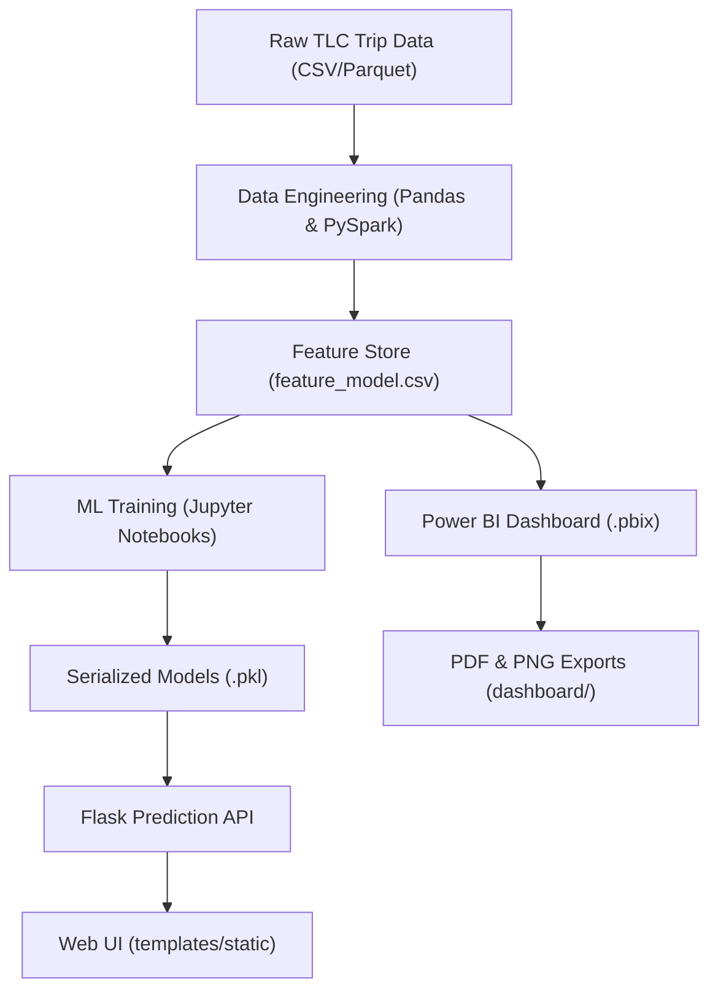

# Predictive Analytics for NYC Taxi System

## Project Overview

This project provides comprehensive predictive analytics for the New York City taxi system, focusing on fare prediction and business insights analysis. The system combines machine learning models with interactive web applications to deliver actionable insights for taxi operations in the post-COVID era.

## Features

- **Fare Prediction Models**: Multiple ML algorithms (Random Forest, XGBoost) for accurate fare estimation
- **Interactive Web Application**: Flask-based web interface for real-time predictions
- **Business Intelligence**: Power BI dashboards with post-COVID taxi system insights
- **Data Visualization**: Comprehensive charts and graphs for data exploration
- **Zone-based Analysis**: Geographic analysis using NYC taxi zones data
- **Feature Engineering**: Advanced feature extraction and selection techniques

## Technology Stack

- **Backend**: Python, Flask
- **Machine Learning**: Scikit-learn, XGBoost, Pandas, NumPy
- **Data Processing**: PySpark (for large datasets)
- **Visualization**: Power BI, Matplotlib, Seaborn
- **Web Frontend**: HTML, CSS, JavaScript
- **Data Storage**: CSV files, Pickle models
- **Development**: Jupyter Notebooks

## System Architecture



1. **Data Layer** – Raw trip, zone-lookup and weather files are cleaned & joined inside `Main/` notebooks (PySpark for scale).
2. **Feature Layer** – Engineered datasets plus a lightweight `feature_model.csv` drive both ML and BI artefacts.
3. **ML Layer** – Notebooks train Random Forest / XGBoost; models are saved as Pickle binaries and loaded by Flask.
4. **Service Layer** – `Flask/taxi_server.py` serves real-time fare predictions; static assets live under `Flask/static/`.
5. **Presentation Layer** – Power BI file renders business dashboards; screenshots + PDF live in `dashboard/` for GitHub viewing.

---

## Project Structure

```
├── Main/                          # Data engineering & modelling
│   ├── *.ipynb                   # Notebooks (feature engineering, training)
│   ├── feature_model.csv         # Feature store snapshot
│   └── *.pbix                    # Local copies of BI visuals (optional)
├── Flask/                         # Prediction micro-service
│   ├── taxi_server.py            # Flask API
│   ├── templates/                # HTML templates
│   └── static/                   # CSS, JS, images, model .pkl files
├── dashboard/                    # Power BI exports & screenshots
│   ├── NYC_Taxi_System_Visualisation.pdf
│   └── screenshots/
│       ├── page1-executive-overview.png
│       ├── page2-revenue-distance.png
│       ├── page3-daily-revenue.png
│       ├── page4-day-of-week-earnings.png
│       ├── page5-descriptive-analysis.png
│       └── page6-key-influencers.png
├── Data ( zones )/               # Geo lookup tables
│   └── taxi_zones.csv
├── images/                       # Misc project images / diagrams
├── requirements.txt              # Python dependencies
└── README.md                     # Project documentation
```

## Getting Started

### Prerequisites

- Python 3.8+
- pip package manager
- Virtual environment (recommended)

### Installation

1. **Clone the repository**
   ```bash
   git clone https://github.com/yourusername/Predictive-Analytics-for-NYC-Taxi-System.git
   cd Predictive-Analytics-for-NYC-Taxi-System
   ```

2. **Set up virtual environment**
   ```bash
   python -m venv venv
   source venv/bin/activate  # On Windows: venv\Scripts\activate
   ```

3. **Install dependencies**
   ```bash
   pip install -r requirements.txt
   ```

### Running the Application

1. **Start the Flask web server**
   ```bash
   cd Flask
   python taxi_server.py
   ```

2. **Access the web application**
   Open your browser and navigate to `http://localhost:5000`

3. **Explore the notebooks**
   ```bash
   jupyter notebook
   ```
   Navigate to the `Main/` directory to explore the analysis notebooks.

## Models and Performance

The project includes several machine learning models for fare prediction:

- **Random Forest**: High accuracy with feature importance analysis
- **XGBoost**: Gradient boosting for enhanced performance
- **Feature Engineering**: Distance calculations, time-based features, zone mappings

## Web Application Features

- **Fare Prediction**: Real-time fare estimation based on pickup/dropoff locations
- **Business Insights**: Interactive dashboards showing taxi system trends
- **Zone Analysis**: Geographic visualization of taxi zones and patterns
- **Cost Calculator**: Simple fare calculation tool

## Business Insights

The project provides comprehensive business intelligence including:

- Post-COVID impact analysis on taxi usage patterns
- Peak hours and demand forecasting
- Geographic hotspots identification
- Revenue optimization strategies

## Development

### Running Development Server
```bash
cd Flask
python taxi_server.py
```

### Jupyter Notebook Development
```bash
jupyter notebook Main/
```

### Model Training
Models are pre-trained and saved as `.pkl` files in the Flask directory. To retrain:
1. Run the notebooks in `Main/` directory
2. Models will be automatically saved for use in the web application

## Documentation

- **Technical Report**: `56809_report.docx` - Detailed technical documentation
- **Business Presentation**: `Business Insights on Post-COVID Taxi System.pptx`
- **Process Flow**: `Process Flow Diagram.pdf` - System architecture overview
